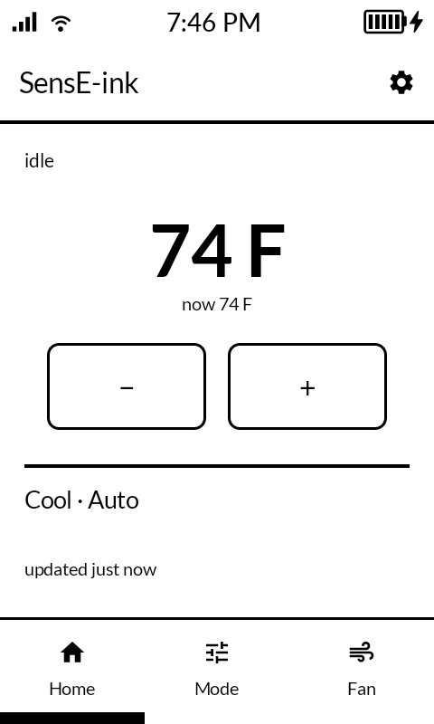
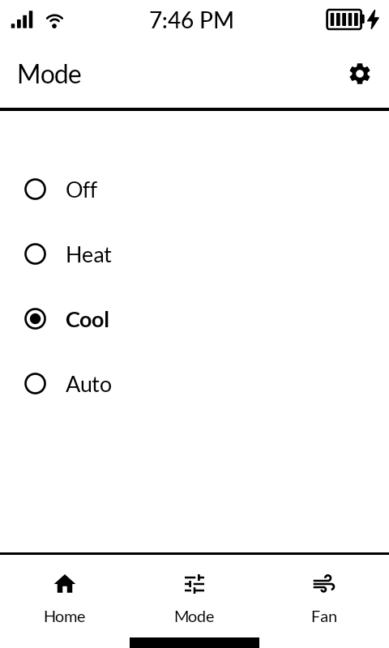
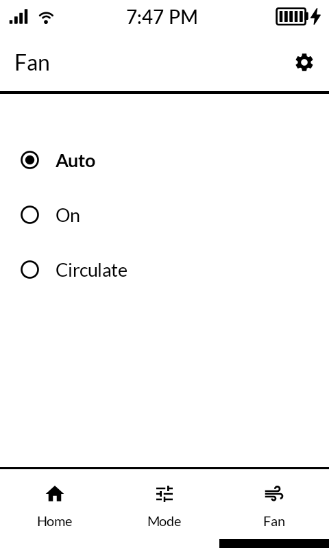
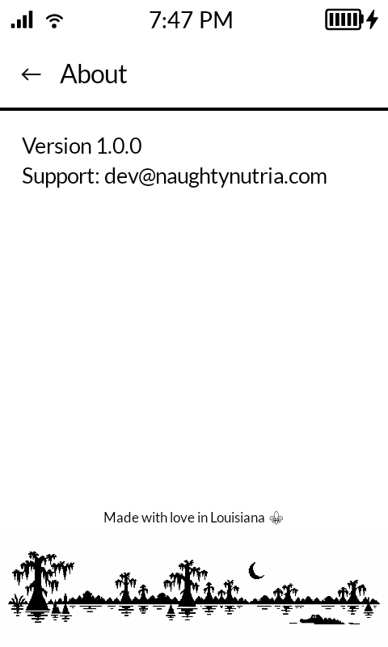

# SensE-ink

A native Android client for Emerson/Copeland **Sensi** thermostats, built for
the **Mudita Kompakt** and other de-Googled E Ink phones. The official Sensi
app refuses to launch on these devices (an install-source check, not an
actual API limitation), so this app talks to the same Sensi cloud API
directly - OAuth plus a realtime socket.io channel - with no Google Play
Services, Firebase, or local HomeKit/LAN pairing involved.

## What it does

- Current state (indoor temperature, humidity, running/idle) and setpoint
  control, merged into one Home screen
- Mode: Off / Heat / Cool / Auto
- Fan: Auto / On / Circulate
- Settings: temperature units, connection status, refresh cadence

Deliberately out of scope: scheduling, geofencing, usage reports, alerts,
push notifications, multi-thermostat support, remote sensors. See
`sensi-client-spec.md` for the full build spec.

## Screenshots

<!-- Not a markdown table - GitHub's table auto-layout sizes each column
     partly off its own header text width, so "Fan" (3 chars) got a
     narrower column - and so a visibly smaller rendered image - than
     "Home"/"Mode"/"About" despite all four screenshots being
     pixel-identical (480x800) source files. Even an explicit width= on
     the  didn't override it, since max-width:100% still shrinks the
     image to fit whatever narrow column the table produced. Plain inline
     images side by side aren't subject to that at all. -->
<p align="center">




</p>

(Home/Mode/Fan shown with representative data, not a live thermostat.)

## Thermostat compatibility

Built and verified end-to-end against a **Sensi ST55** (1F87U-42WF
hardware). `sensi-client-spec.md` documents that unit's live payload as
reporting single-stage electric heat / single-stage AC - but the physical
system behind it is actually **a heat pump with auxiliary heat**, which
wasn't accounted for when that was written. Whether that shows up as an
unrecognized Mode value, a second heating stage the app doesn't track, or
something the app already handles by accident, hasn't been determined -
see the open item in `PROJECT-STATUS.md`. Practically: aux-heat behavior
has never knowingly been exercised against this app, on the very unit
everything else was tested on.

This app authenticates against Sensi's cloud *account* API, not a specific
thermostat model - the same API the official Sensi app uses for its whole
current lineup:

| Model | Model # |
|---|---|
| Sensi Lite | ST25 / 1F76U-22WFB |
| Sensi (standard) | ST55 / 1F87U-42WF |
| Sensi Touch 2 | ST76 / 1F96U |

Recent discontinued models still in the field (Sensi Touch / ST75 /
1F95U-42WF, Sensi Wi-Fi Programmable / UP500W / 1F86U) use the same account
API too. Any Sensi thermostat registered to your Sensi account should be
able to pair with this app.

That said, a few things are hardcoded from the one unit this was built
against and haven't been tested on anything else:

- **Modes are fixed to Off/Heat/Cool/Auto.** The app doesn't read the
  thermostat's live capabilities, so any mode value it doesn't recognize -
  aux/emergency heat included, if the API surfaces one - falls back to
  showing "Off."
- **"Circulate" always appears as a fan option**, even on thermostats that
  don't support it (the older non-HomeKit ST55 hardware, model
  1F86U-42WF, doesn't). Selecting it on unsupported hardware shows a
  default duty-cycle value rather than detecting that it's unavailable.
- **Multi-stage heating/cooling isn't handled.** The app assumes
  single-stage equipment throughout; a heat pump's primary + auxiliary
  heat is effectively two stages, and behavior there - along with other
  2-stage/heat-pump configurations (2H/2C, 4H/2C) - is unverified.

If you try this on a different Sensi model - or on the developer's own
heat-pump-plus-aux setup - expect rough edges specifically in Mode and
Fan. The setpoint, indoor temperature, and connection basics don't depend
on any of the above and should work regardless.

## Setup

The in-app setup screen walks through pairing without ever entering your
Sensi password on the device itself. Sensi's token endpoint added
reCAPTCHA-style bot detection in app v8.6.3+ that a direct, programmatic
login can't pass - logging in through an actual browser still works
completely normally, which is exactly what the pairing flow relies on: it
starts a local server so a computer on the same WiFi can log in there and
hand the resulting token back to this device.

## Building

```
./gradlew assembleDebug
```

See `AGENTS.md` and `PROJECT-STATUS.md` for build requirements, target
device details, and the project's current state if you're contributing.
